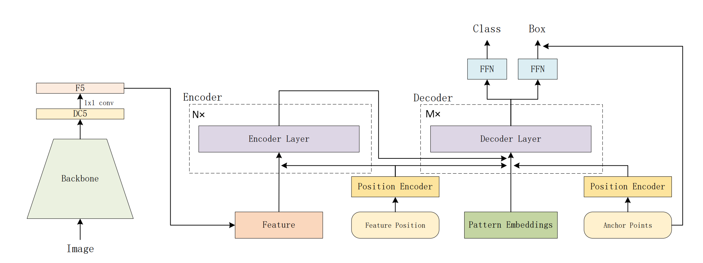
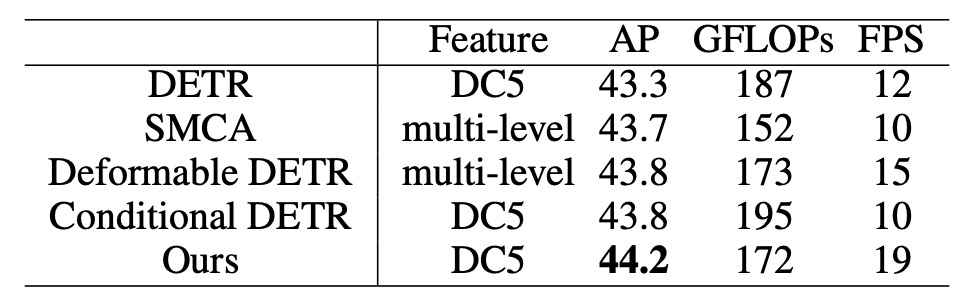
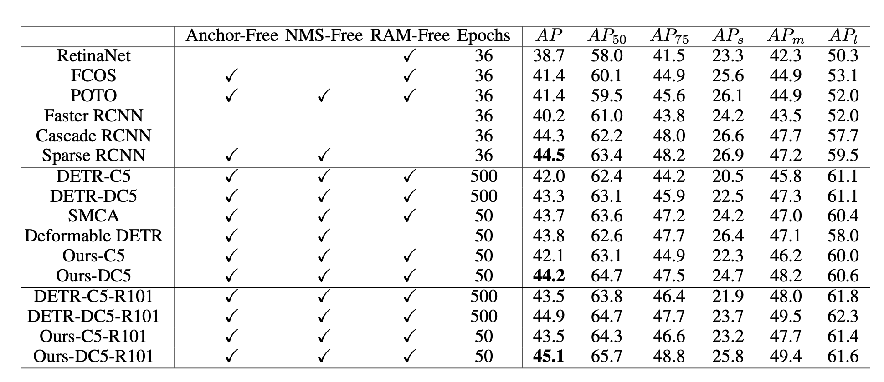

## 总述
本项目主要贡献包括:
- 基于TensorRT在Nvidia GPU平台实现Anchor DETR模型的转换和加速

  开源代码地址：<https://github.com/megvii-research/AnchorDETR>
- 优化效果（精度和加速比）
- 在Docker里面代码编译、运行步骤的完整说明
  - 请做到只要逐行运行你给的命令，就能把代码跑起来，比如从docker pull开始

## 原始模型
### 模型简介
Anchor DETR是由旷视科技孙剑团队于2021年9月提出并于最近开源的Transformer目标检测器。



其特色是采用anchor point（锚点）查询设计，因此每个查询只预测锚点附近的目标，因此更容易优化。

并且为了降低计算的复杂度，作者团队还提出了一种注意力变体，称为行列解耦注意力（Row-Column Decoupled Attention）。
行列解耦注意力可以有效降低计算成本，同时实现与DETR中的标准注意力相似甚至更好的性能。



最终实验显示与DETR相比，Anchor DETR可以在减少10倍训练epoch数的情况下，获得更好的性能。



论文地址：<https://arxiv.org/abs/2109.07107>

### 模型优化的难点
- 原始模型导出ONNX时，出现错误
```
Traceback (most recent call last):
  File "export_onnx.py", line 61, in <module>
    export_onnx()
  File "export_onnx.py", line 48, in export_onnx
    model_sim, check_ok=simplify(onnx.load(onnx_path))
  File "/usr/local/lib/python3.6/dist-packages/onnx_simplifier-0.3.5-py3.6.egg/onnxsim/onnx_simplifier.py", line 483, in simplify
  File "/usr/local/lib/python3.6/dist-packages/onnx_simplifier-0.3.5-py3.6.egg/onnxsim/onnx_simplifier.py", line 384, in fixed_point
  File "/usr/local/lib/python3.6/dist-packages/onnx_simplifier-0.3.5-py3.6.egg/onnxsim/onnx_simplifier.py", line 480, in constant_folding
  File "/usr/local/lib/python3.6/dist-packages/onnx/checker.py", line 99, in check_model
    protobuf_string = model.SerializeToString()
ValueError: Message onnx.ModelProto exceeds maximum protobuf size of 2GB: 7753581684
```
    
> 通过查看github issue需要更新util/misc.py中nested_tensor_from_tensor_list方法，防止在进行ONNX导出出现异常，参考如下：
> 
> <https://github.com/megvii-research/AnchorDETR/issues/10>
> 
> <https://github.com/facebookresearch/detr/pull/173>

- 使用trtexec工具模型转换时，出现错误，需要针对算子进行改造
- ONNX模型带有大量零碎的算子，可以通过自定义插件进行整体，能进一步提升模型的运行速度
## 优化过程
