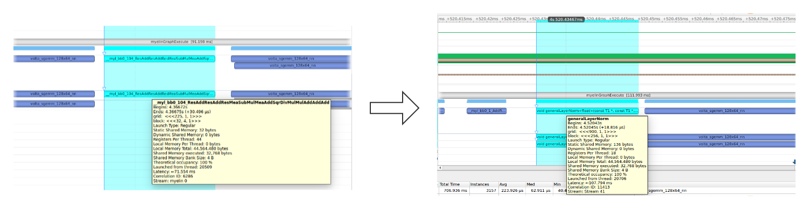

## 总述
本项目主要贡献包括:
- 基于TensorRT在Nvidia GPU平台实现Anchor DETR模型的转换和加速
  - 开源代码地址：<https://github.com/megvii-research/AnchorDETR>
- 通过手动算子融合裁剪以及TensorRT加速技术实现在半精度模式下实时的性能要求，并且精度损失在合理范围内
- 通过对比TensorRT8.4GA和TensorRT8.2得出相关推理性能，TensorRT8.4GA对该类模型在FP16精度下有10%以上，FP32精度有5%以上的性能提升，后期工程实践时尽量以FP16精度为主
- 提供了TensorRT下8比特模型量化的实现，方便后期进一步的优化提升
- 提供了在Docker里面代码编译、运行步骤的完整说明

## 原始模型
### 模型简介
Anchor DETR是由旷视科技孙剑团队于2021年9月提出并于最近开源的Transformer目标检测器。


其特色是采用anchor point（锚点）查询设计，因此每个查询只预测锚点附近的目标，因此更容易优化。

并且为了降低计算的复杂度，作者团队还提出了一种注意力变体，称为行列解耦注意力（Row-Column Decoupled Attention）。
行列解耦注意力可以有效降低计算成本，同时实现与DETR中的标准注意力相似甚至更好的性能。


最终实验显示与DETR相比，Anchor DETR可以在减少10倍训练epoch数的情况下，获得更好的性能。


论文地址：<https://arxiv.org/abs/2109.07107>

### 模型优化的难点
- 原始模型导出ONNX时，出现错误
```
Traceback (most recent call last):
  File "export_onnx.py", line 61, in <module>
    export_onnx()
  File "export_onnx.py", line 48, in export_onnx
    model_sim, check_ok=simplify(onnx.load(onnx_path))
  File "/usr/local/lib/python3.6/dist-packages/onnx_simplifier-0.3.5-py3.6.egg/onnxsim/onnx_simplifier.py", line 483, in simplify
  File "/usr/local/lib/python3.6/dist-packages/onnx_simplifier-0.3.5-py3.6.egg/onnxsim/onnx_simplifier.py", line 384, in fixed_point
  File "/usr/local/lib/python3.6/dist-packages/onnx_simplifier-0.3.5-py3.6.egg/onnxsim/onnx_simplifier.py", line 480, in constant_folding
  File "/usr/local/lib/python3.6/dist-packages/onnx/checker.py", line 99, in check_model
    protobuf_string = model.SerializeToString()
ValueError: Message onnx.ModelProto exceeds maximum protobuf size of 2GB: 7753581684
```
    
> 通过查看github issue需要更新util/misc.py中nested_tensor_from_tensor_list方法，防止在进行ONNX导出出现异常，参考如下：
> 
> <https://github.com/megvii-research/AnchorDETR/issues/10>
> 
> <https://github.com/facebookresearch/detr/pull/173>

- 使用trtexec工具模型转换时，出现错误，需要针对算子进行改造
- ONNX模型带有大量零碎的算子，可以通过自定义插件进行整体，能进一步提升模型的运行速度
## 优化过程
### 冗余算子移除
使用onnx surgeon去除无意义的胶水算子，以方便TensorRT更好的算子融合。


### 构建期提前计算
针对固定表结构在构建模型时进行提前计算，减少模型运行时开销。
如下图所示，通过将2个Clip算子、Div以及Log算子的计算过程提前进行，就能有效的融合进Add算子中。

### LayerNorm算子融合
针对导出LayerNorm存在大量胶水算子，通过手动融合，实现自定义算子的方式加速模型运行。
下面展示算子融合前后的对比


通过迁移适配FastTransformer中LayerNorm算子，在测试显卡T4上最高实现30%以上的性能提升。



## 优化效果
### 算子数量对比
从2325降低到1985，整体算子降低14%。
### 性能和精度对比

|优化手段|软件版本|硬件平台  |精度 |延迟(ms)|帧率(fps)|绝对误差|相对误差|
|-------|----|-----------------|----|-------|---------|-------|-------|
|pytorch加速|pytorch1.8|V100 |FP32|62.5   |16       |无      |无     |
|优化|TensorRT8.2|A10 |FP32|32.9   |30.4     |4.2e-2|1.3e-4|
|优化|TensorRT8.2|A10 |FP16|26.5   |37.7     |1.4e-1|4.1e-4|
|优化|TensorRT8.2|A10 |INT8|24.9   |40.1     |3.9e0 |1.3e-2|
|优化|TensorRT8.4|A10 |FP32|31.5   |31.7     |2.2e-2|9.5e-5|
|优化|TensorRT8.4|A10 |FP16|22.3   |44.8     |5.2e-1|8.1e-4|
|优化|TensorRT8.4|A10 |INT8|-|-|-|-|


## 代码框架
- AnchorDETR
  - AnchorDETR官方代码，新追加了导出脚本
- Model
  - 模型位置，通过[百度云盘](https://pan.baidu.com/share/init?surl=iB8qtVPb9dWHYgA5z1I4xg)（code: hh13）下载模型，本实验采用模型为anchor-detr-dc5。
- Trt
  - LayerNorm: layernorm自定义算子，适配自FastTransformer
  - TrtExec.cpp: TensorRT模型加速代码
  - surgeonModel.py: onnx模型融合简化脚本
  - profileModel.py: TensorRT模型性能评估脚本
  - data: npz文件为模型性能评估对比数据，calibration为模型int8量化数据

## Docker运行
* 搭建Docker运行环境

  1. docker pull nvidia/cuda:11.4.2-cudnn8-devel-ubuntu20.04

* 导出ONNX模型

  1. 通过百度云盘下载AnchorDETR_r50_dc5.pth模型，将模型放置于Model目录。
  2. 进入AnchorDERT，执行模型导出脚本

  `python3 export_onnx.py --checkpoint ../Model/AnchorDETR_r50_dc5.pth`

  3. 模型导出成功，会在Model目录下创建anchor-detr-dc5.onnx。

* 模型优化
  1. 进入Trt目录，运行surgeonModel.py脚本，优化模型。

  `python3 surgeonModel.py ../Model/anchor-detr-dc5.onnx ../Model/dc5_new.onnx`
  
  2. 模型优化成功，会在Model目录下创建dc5_new.onnx。

* TensorRT加速
  1. 进入Trt目录，编译生成TensorRT转换可执行文件。
  `mkdir build && cd build && cmake .. && make j4`
  2. 运行./build/AnchorDETRTrt加速模型
    - FP32模型加速: 
    
    `./build/AnchorDETRTrt ../Model/dc5_new.onnx 0 0`
    - FP16模型加速: 
        
    `./build/AnchorDETRTrt ../Model/dc5_new.onnx 1 0`

    - INT8模型加速:

    `./build/AnchorDETRTrt ../Model/dc5_new.onnx 0 1`
* 性能和精度评估
  1. 进入Trt目录，执行profileModel.py脚本。
  `export LD_LIBRARY_PATH=$LD_LIBRARY_PATH:/usr/local/TensorRT-8.4.0.6/targets/x86_64-linux-gnu/lib/`

  `python3 profileModel.py --plan build/AnchorDETR.plan`

  2. 观察输出结果。

## 经验与体会

通过本次比赛能对onnx模型裁剪操作、TensorRT加速流程有了更深入的理解，在Transformer模型加速、算子融合、TensorRT自定义算子方面积累了丰富的工程实践经验。

后期还会继续AnchorDETR模型在低精度上的研究，使其在INT8和FP16上有更好的工程应用。

## Known Issue
* INT8模型量化在TensorRT8.4上无法正常模型加速。

```
ERROR: 2: [checkSanity.cpp::checkSanity::106] Error Code 2: Internal Error (Assertion regionNames.find(r->name) == regionNames.end() failed. Found duplicate region name (Unnamed Layer* 417) [Constant]_output')
Segmentation fault (core dumped)
```
* INT8模型量化在TensorRT8.2上加速比出现回退，需要通过nsys进行定位。